# Расширение для браузера Yandex
## Описание проекта
PILATES-STYLE - это пользовательский стиль для официального сайта Казанского авиационного института (kai.ru), который применяет спокойную и гармоничную цветовую палитру, вдохновленную эстетикой пилатеса:

🧘‍♀️ Нежные пастельные тона - розовые, бежевые и серые оттенки

✨ Плавные переходы и тени - мягкие визуальные эффекты

🎀 Элегантный минимализм - чистый и гармоничный дизайн

🔄 Интуитивное управление - кнопка-переключатель темы

## PILATES-STYLE - Функциональность
Кнопка переключения
Появляется в правом верхнем углу страницы
Показывает: "🌙 Включить Pilates-стиль" (когда выключено)
Показывает: "🎀 Вернуть базовый стиль" (когда включено)
Статус стиля сохраняется при перезагрузке страницы
Работает после повторного открытия браузера
Работа на всех страницах
Главная страница kai.ru
 15+ стилевых свойств
Изменены:
Фон страницы и блоков
Цвета текста и заголовков
Кнопки и ссылки
Тени и границы
Отступы и скругления
Социальные иконки
Формы авторизации
Элементы расписания

## Инструкция
1. Скачайте все файлы плагина в одну папку
2. Откройте в Yandex `browser://extensions/` или перейдите в `Настройки` → `Расширения`
4. Включите "Режим разработчика" 
5. Нажмите "Загрузить распакованное расширение"
6. Выберите папку с файлами плагина
7. Нажмите "Выбор папки"
8. Включите расширение 
9. Зайдите на сайт kai.ru
10. Нажмите на появившуюся кнопку "в🌙 Включить Pilates-стиль"

# Расширение для стилизации веб-страниц

# Расширение для стилизации веб-страниц

## Примеры работы расширения

### Пример 1
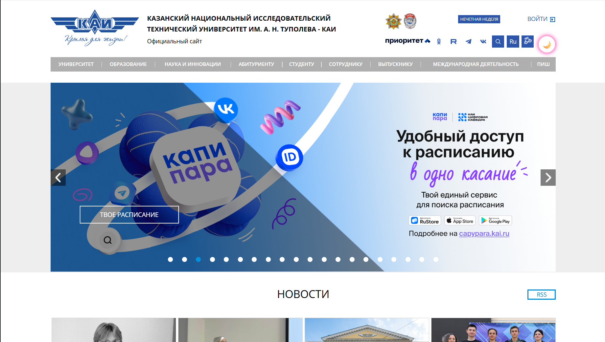  
  

### Пример 2
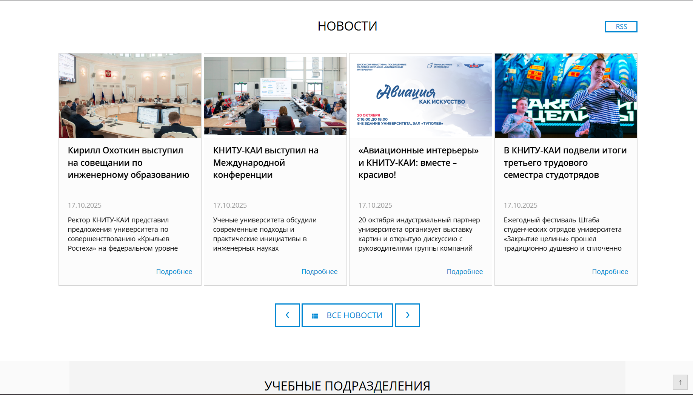  
  

### Пример 3
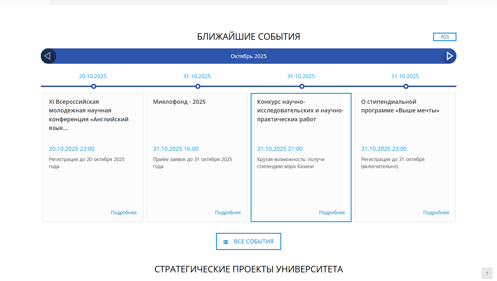  
  

### Пример 4
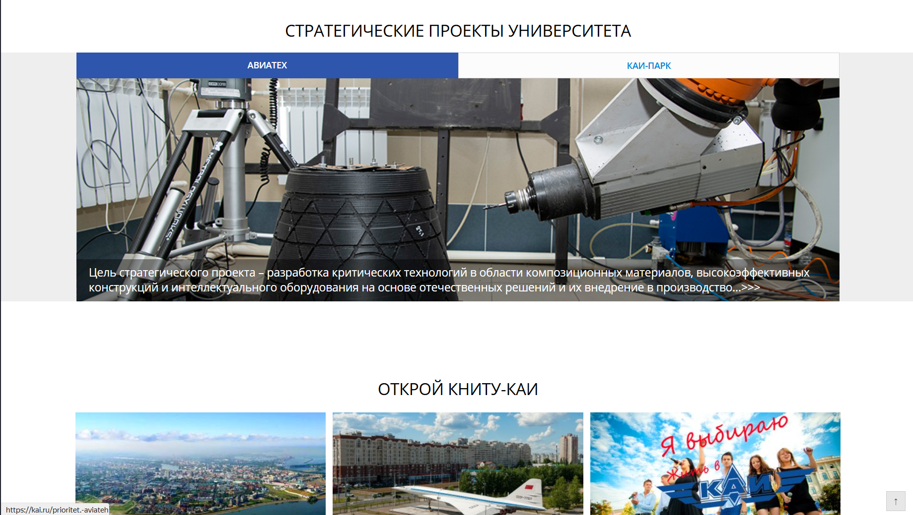  
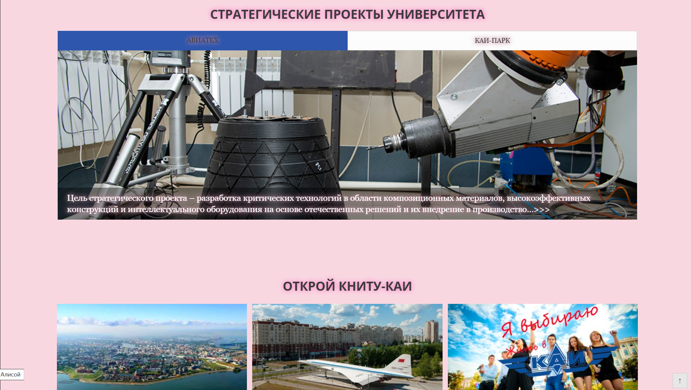  

### Пример 5
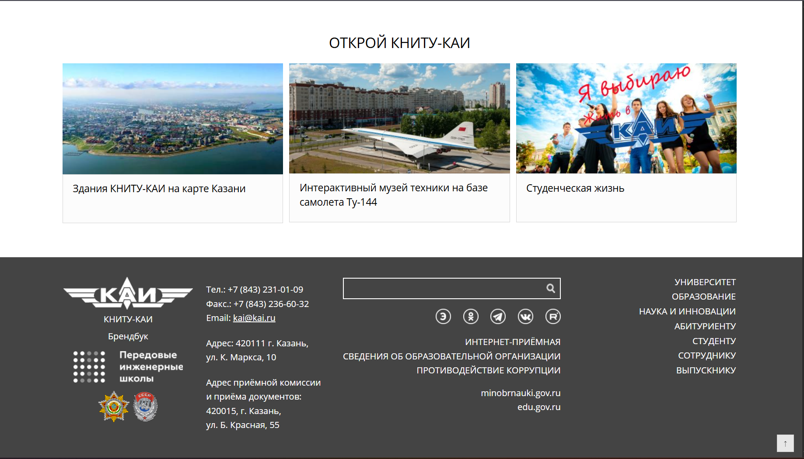  
  
#### НАВИГАЦИЯ
###  Пример 6 
  
  

### Пример 7
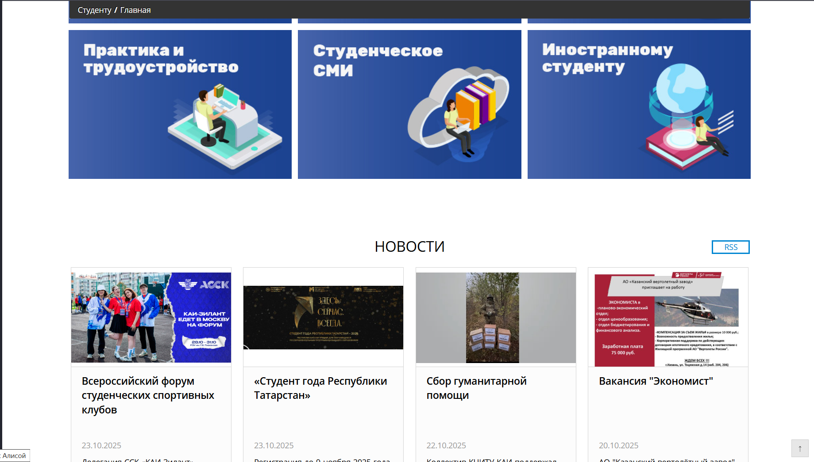  
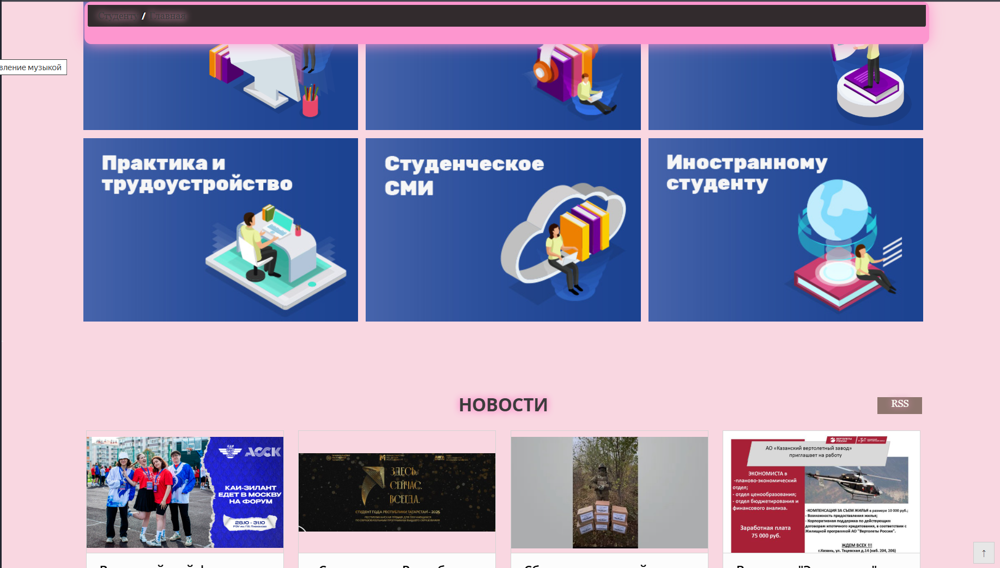  

### Пример 7
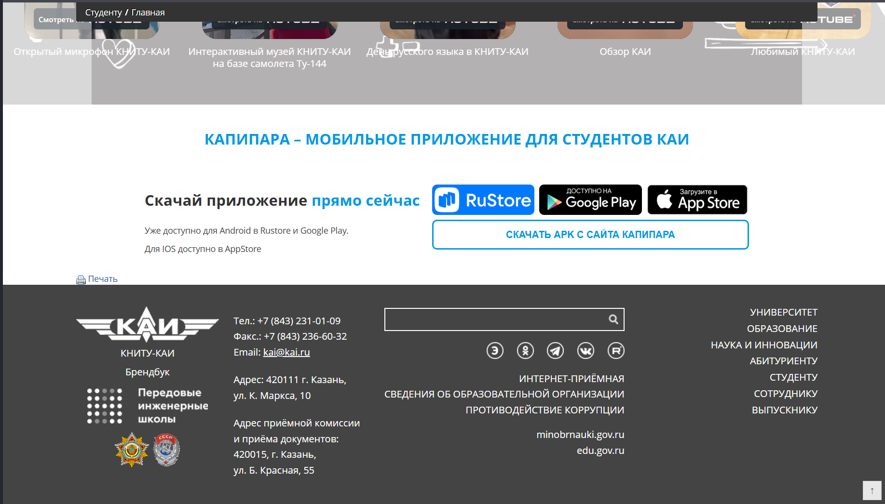  
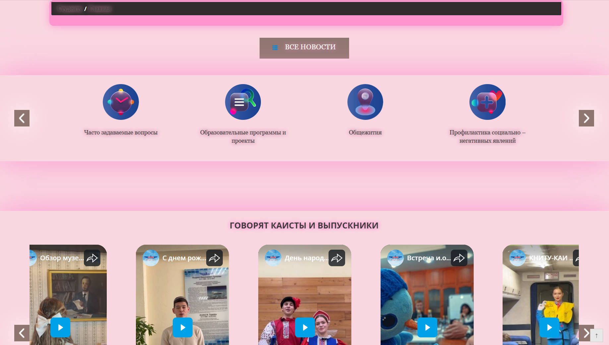

### Пример 7
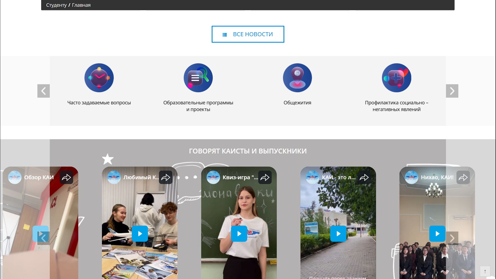  
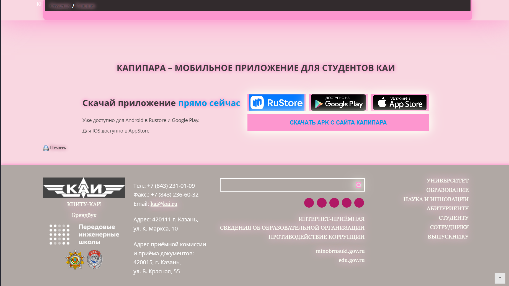
