# Телеграм - бот для рекламного агентства "Sadyr Studio".

# Проект
1. Создание рекламных объявлений (/create_ad)
Опрос пользователя: Задает серию вопросов о продукте, аудитории, преимуществах и целях для сбора контекста.

Генерация текстов: Создает креативные варианты текстов объявлений на основе ответов пользователя.

Выбор стиля: Creative (креативный), Formal (формальный), Playful (игровой).

Выбор размера: Small (короткий), Medium (средний), Large (подробный).

Готовые шаблоны: Предоставляет адаптированные шаблоны для популярных площадок:

TikTok, Instagram, Telegram, Twitch.

Проверка на правила: Анализирует текст на наличие запрещенных слов и соответствие рекламным правилам. 
Есть выход на главное меню и можно переписать данные, если была совершена ошибка

2. Управление бюджетом и расходами (/budget)
Калькулятор бюджета: Помогает рассчитать бюджет кампании на основе целей, KPI и размера аудитории.

Рассчитывает валовую, операционную и чистую прибыль.

Сравнение площадок: Показывает средние цены CPA (цена за действие) и CPM (цена за 1000 показов) для разных рекламных платформ.

Контроль расходов:

Ввод и отслеживание общего бюджета и потраченной суммы.

Расчет остатка бюджета и процента использования.

История расходов: Ведение истории всех операций с возможностью просмотра статистики и очистки данных. Можно выйти на главное меню или выйти к функции бюджет.

## Инструкция по запуску
1. Клонируйте и перейдите в папку с решением:
2. Установите зависимости (npm install)
3. Создайте локальный `.env` 
4. Запустите тесты (npm test)
5. Запустите проверку ошибок (npm run lint)

## Пример работы
### **Главное меню**
Команда `/start`
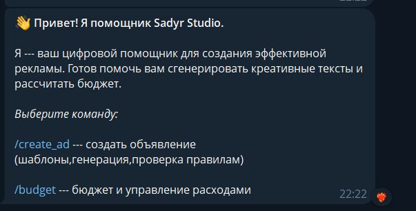

### **Создание объявления**  
Процесс работы с командой `/create_ad`
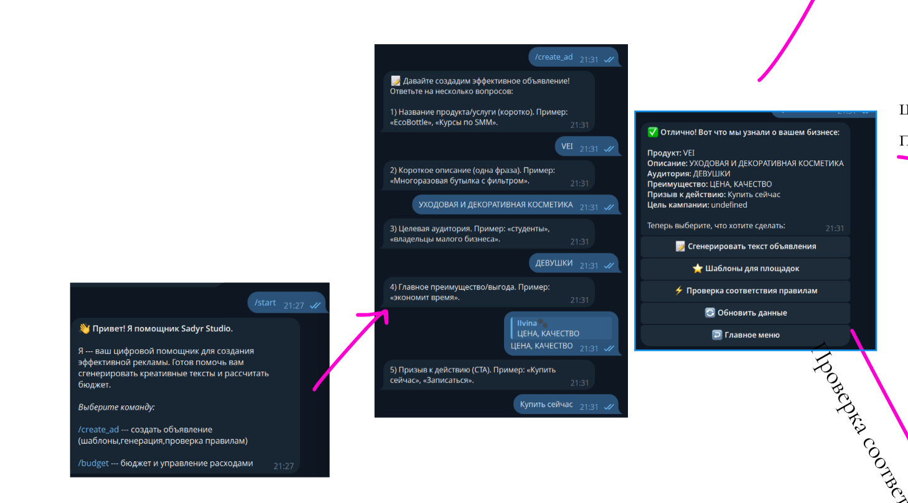
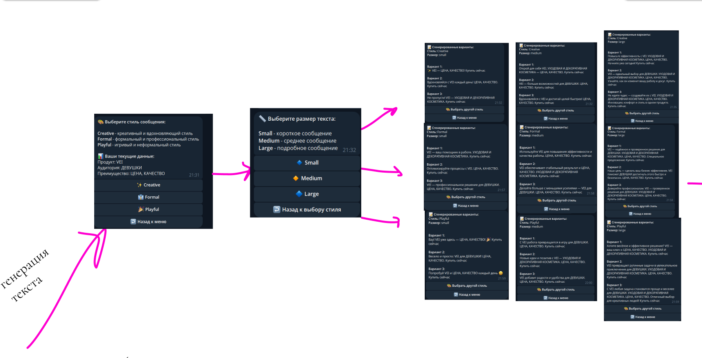 
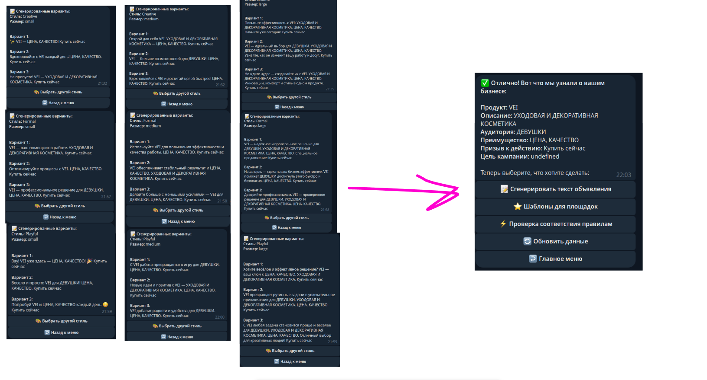
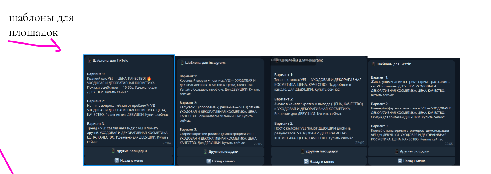
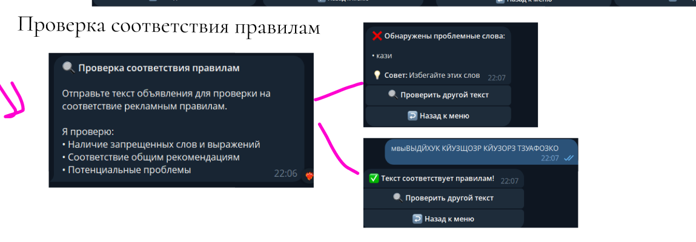

### **Управление бюджетом**
Работа с командой `/budget`
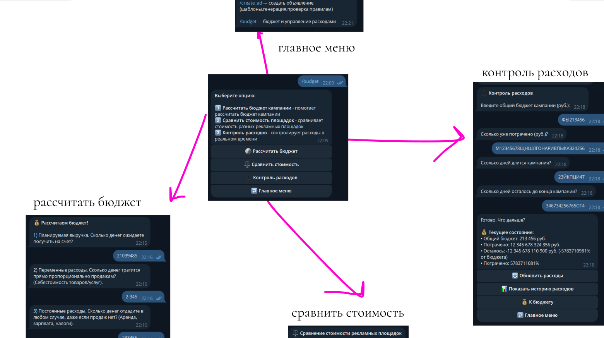
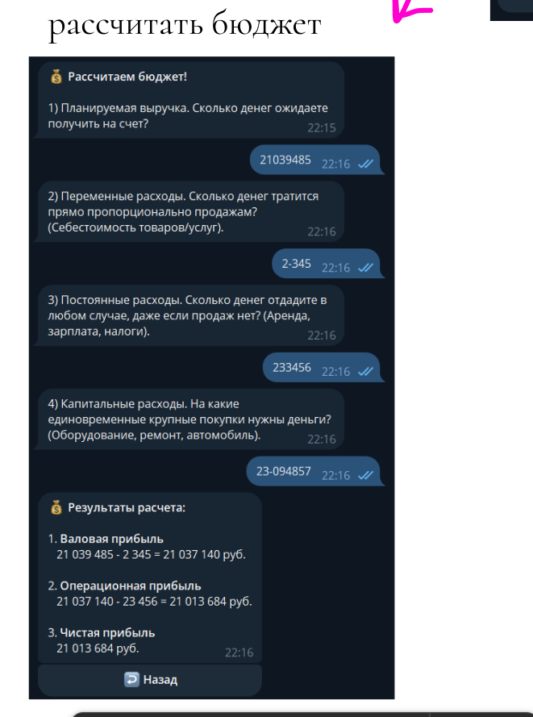
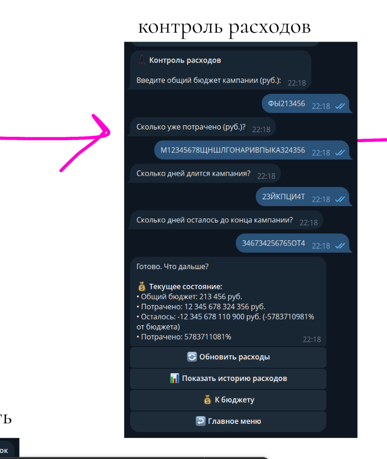
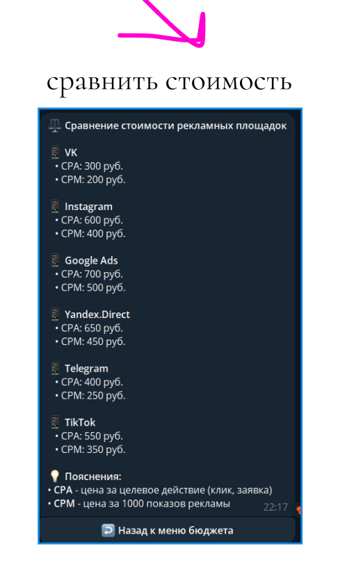
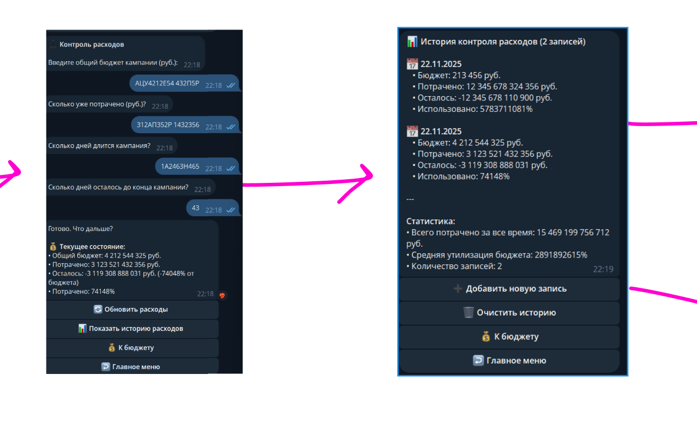
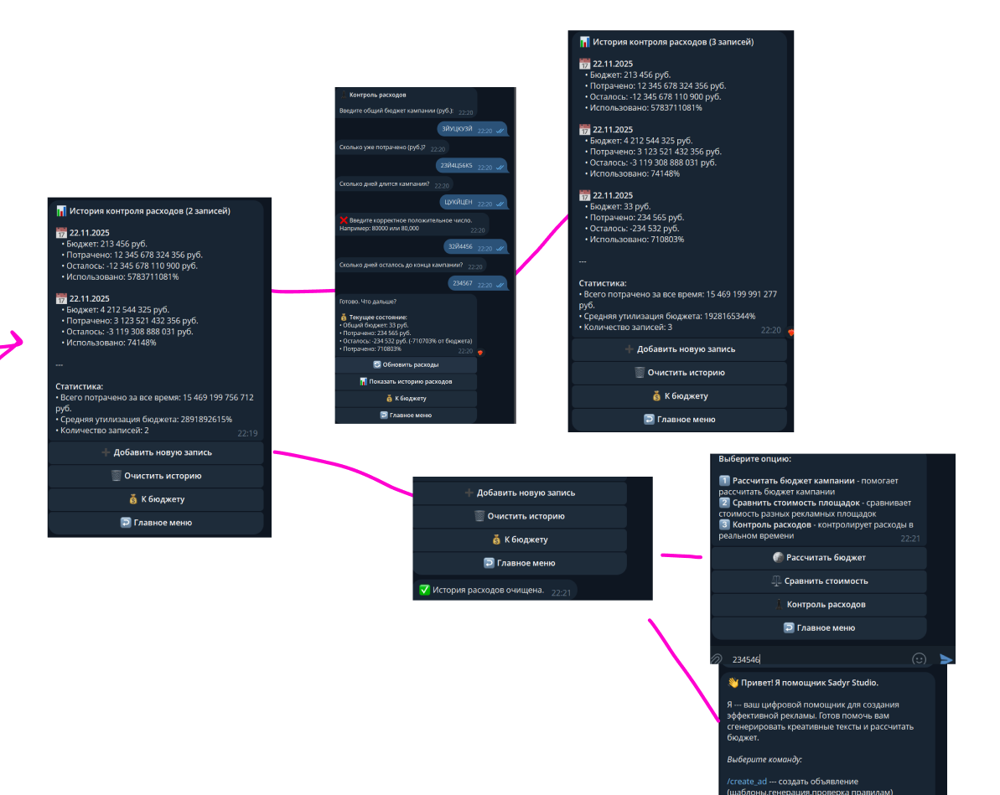